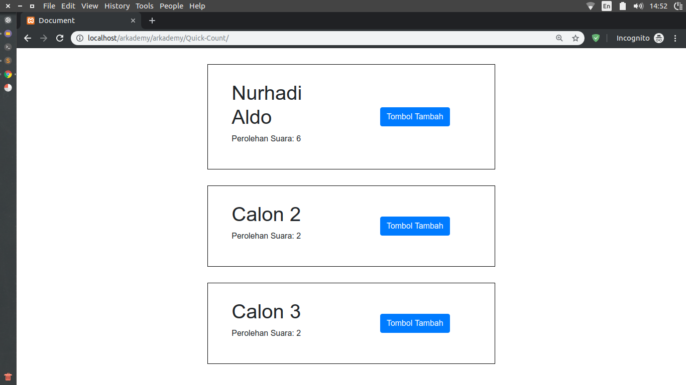

# Arkademy

## Jawaban Tes Arkademy

Jawaban No 1 - 5, bisa dijalankan melalui:
- Terminal yang sudah terpasang nodejs
- Online JavaScript Editor: [es6console.com](https://es6console.com/) atau [playcode.io](https://playcode.io/).

### No 1
- Buka code editor javascript: [playcode.io](https://playcode.io/).
- Copy paste kode tersebut ke playcode.io.
- Maka hasilnya akan muncul berupa data json.

Note:
JSON adalah salah satu mekanisme atau standar yang digunakan untuk melakukan pertukaran data di antara bahasa pemrograman.

### No 2
- Buka code editor javascript: [playcode.io](https://playcode.io/).
- Copy paste kode tersebut ke playcode.io.
- Maka hasilnya akan muncul berupa true atau false berdasarkan parameter yang diinput.

### No 3
- Buka code editor javascript: [playcode.io](https://playcode.io/).
- Copy paste kode tersebut ke playcode.io
- Maka hasilnya akan muncul berupa pola sesuai jumlah yang diinput di parameter.

### No 4
- Buka code editor javascript: [playcode.io](https://playcode.io/).
- Copy paste kode tersebut ke playcode.io.
- Maka hasilnya berupa array yang telah disorting.

### No 5
- Buka code editor javascript: [playcode.io](https://playcode.io/).
- Copy paste kode tersebut ke playcode.io.
- Maka hasilnya berupa karakter acak sebanyak jumlah yang diinput di parameter.

### No 6 (Quick Count).
Untuk menjalankan aplikasi Quick Count, lakukan langkah berikut
- Aktifkan web server (apache) atau XAMPP.
- Import file sql di dalam folder Quick Count ke phpmyadmin.
- Pindahkan folder Quick Count ke folder HTDOCS dari aplikasi XAMPP.
- Akses url berikut: localhost/Quick-Count.
- Aplikasi sudah bisa digunakan.

Demo Aplikasi:

##### Credits
Thanks to Arkademy.

Regards, Aufa Billah.
